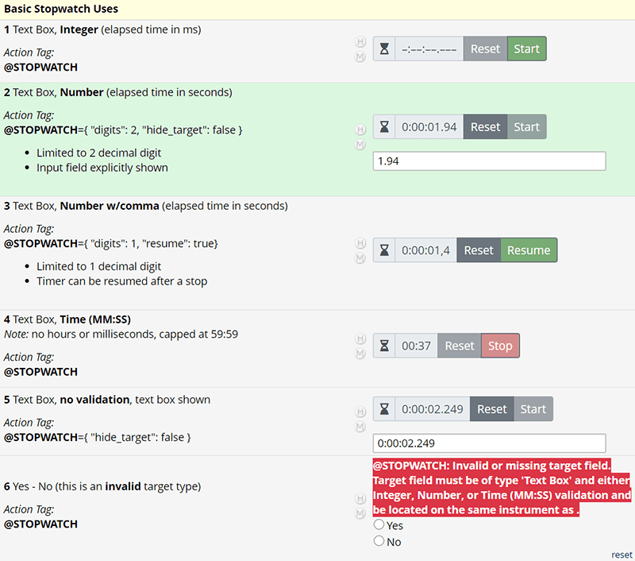
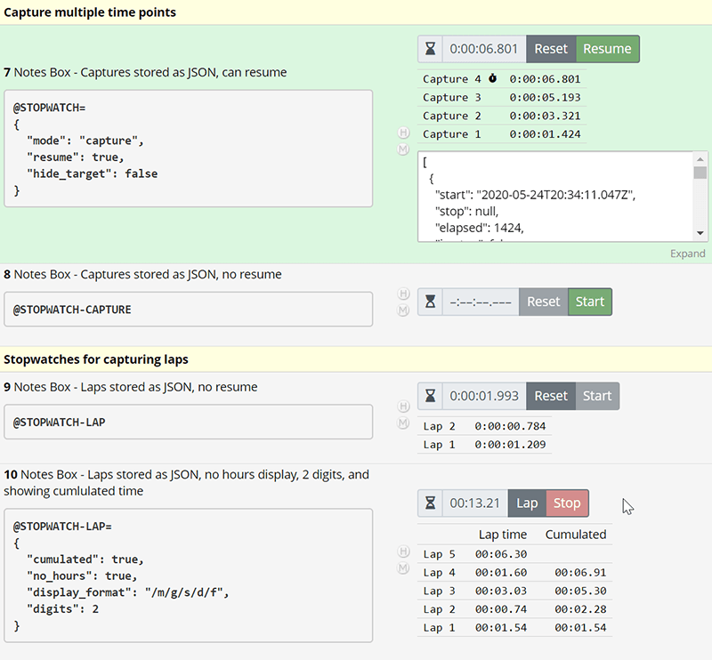
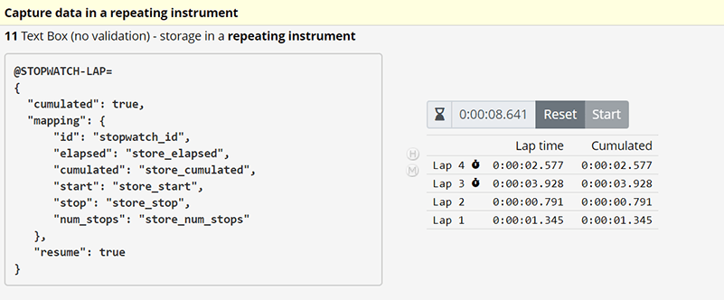
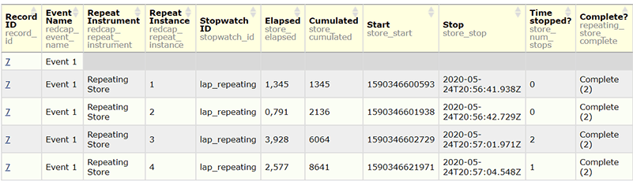
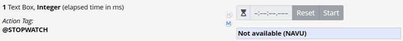

# Stopwatch

A REDCap External Module that provides a stopwatch widget that can be integrated into data entry forms or surveys. Results (elapsed time, times started/stopped) can be captured in a number of ways.

## Installation

- Clone this repo into `<redcap-root>/modules/stopwatch_v<version-number>`, or
- Obtain this module from the Consortium REDCap Repo via the Control Center.
- Go to Control Center > Technical / Developer Tools > External Modules and enable this module.
- Enable the module for any projects that want to make use of it.

## Use

- To include a stopwatch on a form or survey, create a field of any type and add the **@STOPWATCH** action tag.
- The stopwatch widget will be shown in the label or data area of the field in which the **@STOPWATCH** tag is added, depending on the set target.
- Multiple stopwatches can be used on the same form.
- Only one **@STOPWATCH** action tag can be used within each field.

## Action Tag Configuration

Configuration is done via action tag parameters. The parameter string must be written as valid JSON (see [https://jsonlint.com/](https://jsonlint.com/)). The following parameters are supported. _All are optional._

```json
@STOPWATCH=
{
  "string": "value",
  "bool": true,
  "number": 5
}
```

_Note:_ When supplying parameters, the equal sign `=` must touch the action tag (i.e. there must be no space between)! There may be whitespace (even line breaks) between `=` and the opening curly brace.

- `mode` - Mode can be one of the following:
  - `basic` - A simple stopwatch with start/stop and reset button. The elapsed time is recorded. This is the default.
  - `capture` - A stopwatch that can record multiple captures of the (until then) elapsed time (see below for details). `@STOPWATCH-CAPTURE` can be used as a shortcut.
  - `lap` - A stopwatch that can record multiple laps (see below for details). `@STOPWATCH-LAP` can be used as a shortcut.

- `id` - An identifier for the stopwatch. If another field is not specified, this will be equal to `target`. This is useful when storing the data of multiple stopwatches within a single repeating instrument.

- `target` - The field in which the elapsed time will be stored. By default, this will be the field in which the **@STOPWATCH** action tag is used (in which case its type and validation must be compatible - see below).

- `show_target` - Boolean (`true`|`false`) that determines whether the target input should be shown on data entry forms (default to `false`).

- `show_target_survey` - Boolean (`true`|`false`) that determines whether the target input should be idden (default to `false`).

- `resume` - Boolean (`true`|`false`) that determines whether stopping and resuming the timer is allowed (defaults to `false`).

- `digits` - The precisison to show (0, 1, 2, or 3).

- `h_digits`, `m_digits`, `s_digits` - The (minimal) number of digits to use for hours, minutes, econds (when shorter, values will be padded with 0).

- `no_hours` - Boolean (`true`|`false`). If set to `true`, minutes will be the largest unit counted.

- `no_minutes` - Boolean (`true`|`false`). If set to `true`, seconds will be the largest unit ounted. This will imply `no_hours` = `true`.

- `decimal_separator` - The decimal separator that is inserted between seconds and fractional econds. This will be overriden by certain target field types.

- `group_separator` - The character(s) inserted between hours, minutes, seconds.

- `unset_display_symbol` - The symbol to be used as a digit replacement when no value has been set.

- `display_format` - The format for display in the stopwatch widget.

- `display_running` - When set, this will be displayed when the stopwatch is currently running.

- `display_empty` - When set, this will be displayed when the stopwatch has no value(s).

### Additional configuration for capture and lap modes

Data from a stopwatch capturing multiple timepoints or laps, by default, is stored as a JSON data structure inside a _Notes Box_ or _Text Box_ (without validation), unless `mapping` is specified, in which case the data is stored in the fields of another form. In the latter case, `target` must still exist and be a _Text Box_ without validation, as some metadata needs to be stored there (this field should typically not be shown and made read only).

- `mapping` - A JSON object with the following keys. All except `elapsed` are optional. All fields must be on the same repeating instrument, separate from the field in which the **@STOPWATCH** action tag is used. The exact storage format depends on the chosen field type (see below).
  - `id` - Field for storing the id of the stopwatch. This must be a _Text Box_ without validation. This mapping is useful when capturing the data from multiple stopwatches in the same repeating instrument.
  - `elapsed` - Field for storing the elapsed time. This mapping **must** be provided.
  - `start` - Field for storing the date/time the capture was (first) started.
  - `stop` - Field for storing the date/time the capture was (last) stopped.
  - `cumulated` (`lap` mode only) - Field for storing the cumulated elapsed time.
  - `num_stops` (`lap` mode only) - Field for storing the number of times the timer was stopped during recording of a lap (the target field must be of type integer).
  - `is_stop` (`capture` mode only) - Field for storing the stop flag (the target field must be of type integer - it will hold 0 or 1).

- `event` - The event name (or numerical id) of the event of the repeating form with the capture or lap mapping fields. If not specified, the current event is assumed.

- `only_once` - Boolean (`true`|`false`) determining whether the stopwatch can be used again once a value has been recorded. The default is `false`.

- `max_rows` - The maximum number of rows to show in the captures/laps table. Default = 0 (no limit).

- `cumulated` (available in `lap` mode only) - Boolean (`true`|`false`). If set to `true`, an additional column with cumulated elapsed time will be shown.

### Format of the stored values

Stopwatch will honor the format (validation) of the target field(s). The target field has to be of type _Text Box_ or _Notes Box_.

Elapsed time will be stored as follows:

- _Integer_: elapsed time in milliseconds.
- _Number_: elapsed time in seconds (with fractional seconds).
- _Time (MM:SS)_: elapsed time in minutes and seconds (limited to max 59:59).
- No validation: the elapsed time will be stored as `h:m:s.f` (colons and dot).

For capture and lap data values other than elapsed time, the following automatic formats will be used, depending on the field type:

- _Integer_: the (local) time represented by number of milliseconds elapsed since the start of the epoch, 01 January, 1970 00:00:00 Universal Time (UTC).
- _Number_: as above, but in seconds (including fractional seconds).
- _Date_: The date. Time information will be lost.
- _Datetime_: The date and time. Some time information will be lost.
- No validation: A datetime value in the ISO 8601 format `yyyy-mm-ddThh:mm:ss.fff`.

### Format of the timer display

To set the display format, these placeholders can be used:

- `/h` - hours (1 or more digits)
- `/m` - minutes (2 digits)
- `/s` - seconds (2 digits)
- `/f` - fractional seconds
- `/S` - total seconds (with fractional seconds)
- `/F` - total milliseconds
- `/g` - group separator
- `/d` - decimal separator

The display format for e.g. `0:02:33.12` can be written as `/h/g/m/g/s/d/f`, and `digits` would have to be set to `2`.

### Button and other labels

Labels of buttons and other display elements can be customized using the following parameters:

- `label_start` - Start button label. Default is 'Start'.
- `label_resume` - Resume button label. Default is 'Resume'.
- `label_stop` - Stop button label. Default is 'Stop'.
- `label_reset` - Reset button label. Default is 'Reset'.
- `label_lap` - Lap button label (also used as row label). Default is 'Lap'.
- `label_capture` - Capture button label (also used as row label). Default is 'Capture'.
- `label_elapsed` (`lap` mode only) - Header for the elapsed time column. Default is 'Lap time'.
- `label_cumulated` (`lap` mode only) - Header for the cumulated time column. Default is 'Cumulated'.

## Module Configuration

Behavior of the module can be configured on the project level:

- **Enable JavaScript debug logging**: When enabled, the module will output debug information to the browser console.

## Examples

A demo project is available [here](demo-project/StopwatchEMTest.xml).

**Simple Stopwatches** - capture elapsed time only:



1. No data captured yet. It can be started by clicking the green 'Start' button.

   ```json
   @STOPWATCH
   ```

2. Timer has run. Can be reset.  

   ```json
   @STOPWATCH={ "digits": 2, "show_target": true }
   ```

3. Resume is enabled for this stopwatch. It's currently stopped, but can be resumed (or reset).  

   ```json
   @STOPWATCH={ "digits": 1, "resume": true }
   ```

4. This stopwatch is currently running, indicated by the red 'Stop' button.  

   ```json
   @STOPWATCH
   ```

5. This shows storage in a _Text Box_ without validation.  

   ```json
   @STOPWATCH={ "show_target": true }
   ```

6. This illustrates the case of something going wrong. A very visible error message is displayed in case of a configuration error.

**Advanced Stopwatches** - capture multiple timepoints / laps:



7. Multiple captures into a _Notes Box_ (as a JSON data structure, here shown explicitly).  

   ```json
   @STOPWATCH=
   {
     "mode": "capture",
     "resume": true,
     "show_target": true
   }
   ```

8. Shortcut for a basic capture setup. No further configuration is needed.  

   ```json
   @STOPWATCH-CAPTURE
   ```

9. Stopwatch capturing laps. Resuming is not allowed. The display as shown is re-constituted after saving the form.  

   ```json
   @STOPWATCH-LAP
   ```

10. A stopwatch for capturing laps, showing a _cumulated_ column. The display format has been set so that hours are not shown (minutes will go past 59) and fractional seconds are rounded to 2 digits.  

    ```json
    @STOPWATCH-LAP=
    {
      "cumulated": true,
      "no_hours": true,
      "display_format": "/m/g/s/d/f",
      "digits": 2
    }
    ```

**Advanced Stopwatches** - capture multiple timepoints / laps into a repeating instrument:



11. Multiple captures can be stored in a repeating instrument when `mapping` data items to fields on a repeating instrument are provided. The stored data is shown in the report below. Note that different field types have been set for the various items, which determines the storage format.

    ```json
    @STOPWATCH-LAP=
    {
      "cumulated": true,
      "mapping": {
        "id": "stopwatch_id",
        "elapsed": "store_elapsed",
        "cumulated": "store_cumulated",
        "start": "store_start",
        "stop": "store_stop",
        "num_stops": "store_num_stops"
      },
      "resume": true
    }
    ```



## Integration with Missing Data Codes

Stopwatch supports Missing Data Codes. When set, the stopwatch is disabled and shows the placeholder value. When the missing data code is removed, the stopwatch becomes available again.



## Acknowledgements

This module uses some code from Andy Martin (ActionTagHelper and other bits).

## Changelog

Version | Description
------- | ---------------------
v1.0.0  | Initial release.
